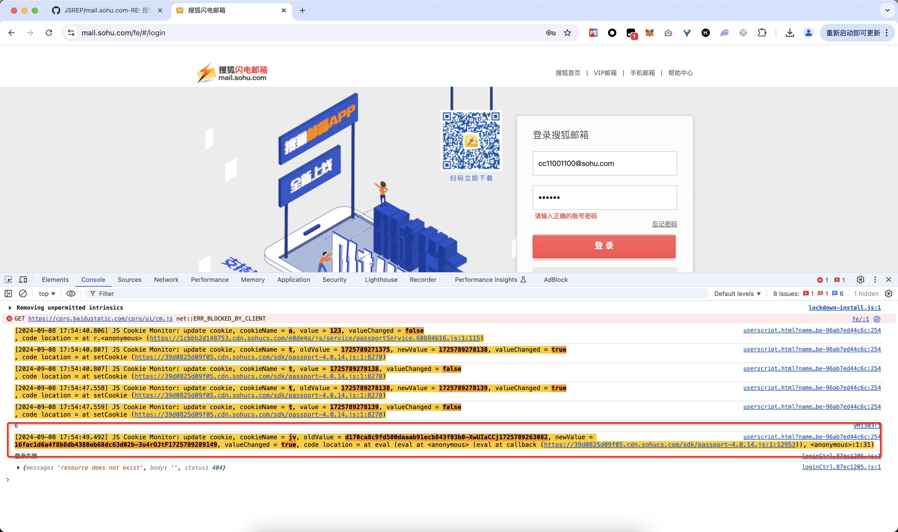
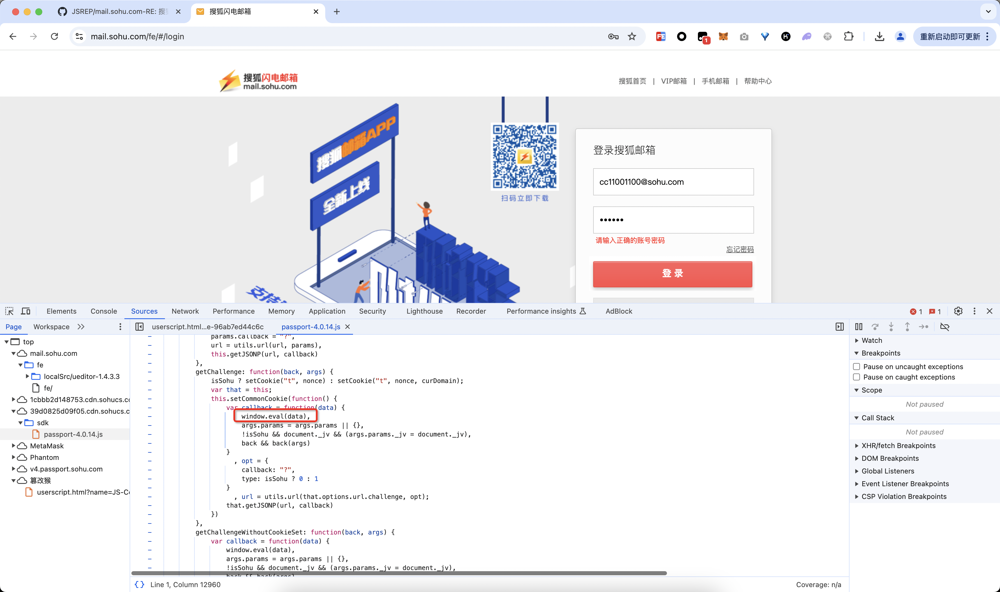
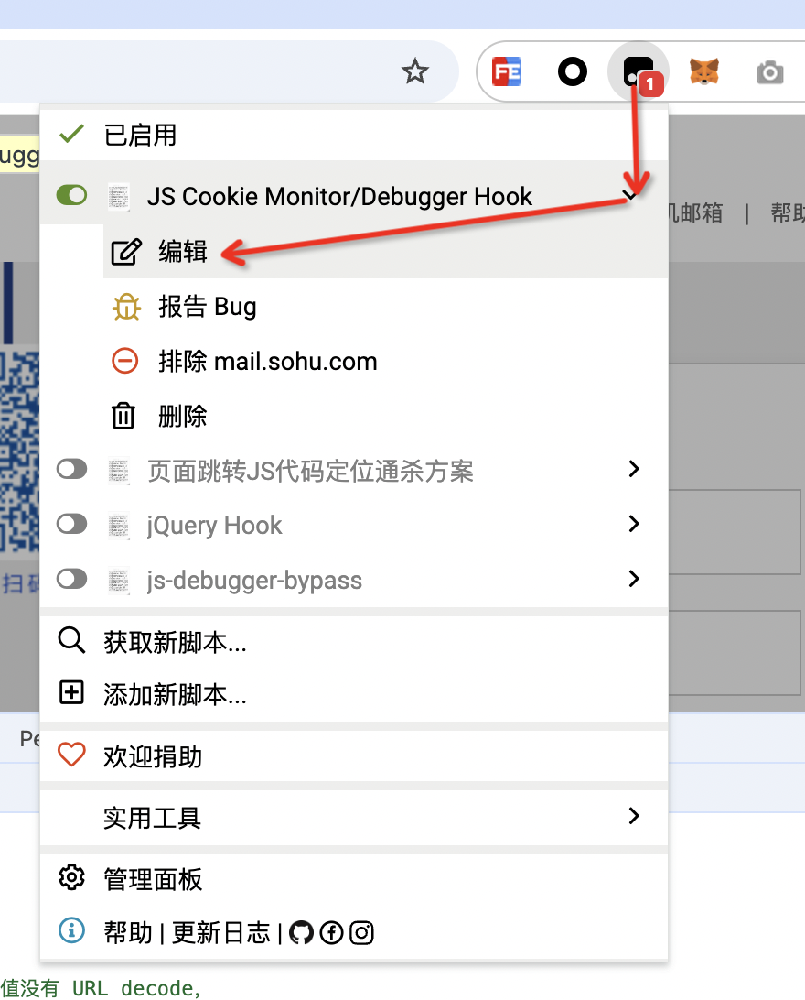
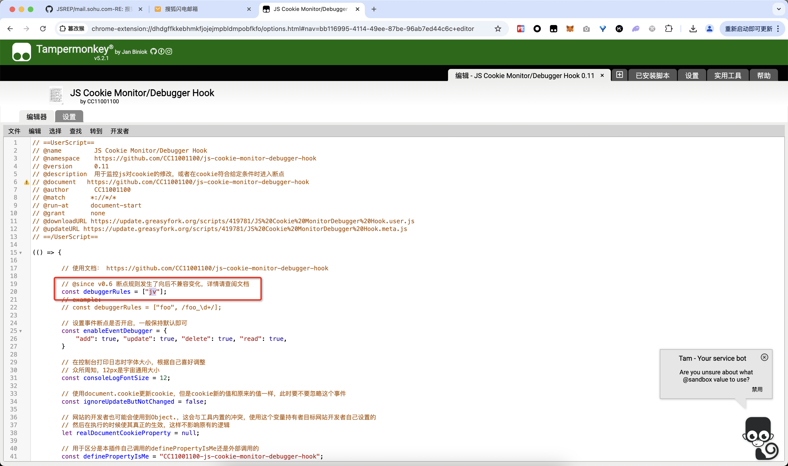
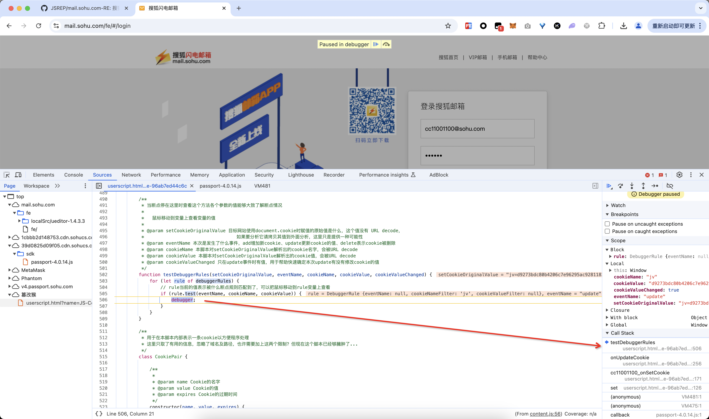
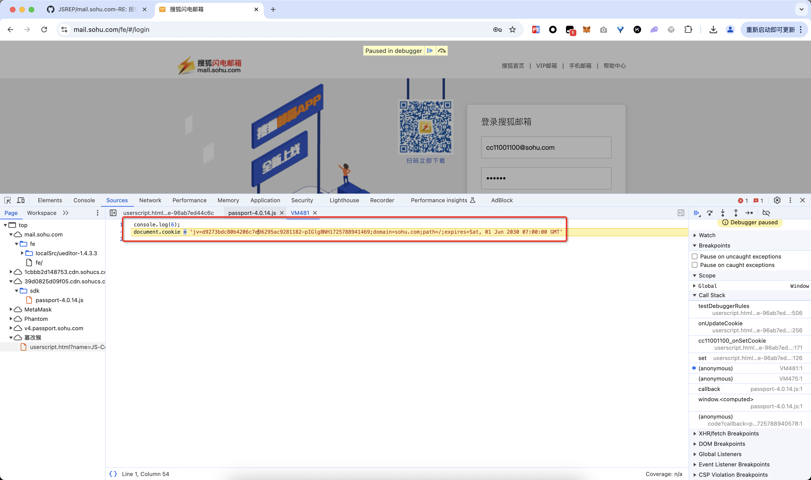

# 搜狐闪电邮箱登录

可以看到在登录的时候有地方悄悄设置了cookie，要携带这个cookie才能登录成功：

直接单击日志里的代码链接，跳转到了一个eval方法，看起来也没有太多有用的信息：

尝试加断点，在油猴这里编辑脚本：

给这个名为`jv`的cookie设置上断点：

然后刷新页面再点击登录按钮设置cookie的时候就触发了断点：

直接追到了VM里面，可以看到这就是设置的cookie的内容：

# 参考资料

- https://github.com/JSREP/mail.sohu.com-RE

- 或者使用这个工具对jsfuck解密 https://github.com/JSREI/eval-decoder