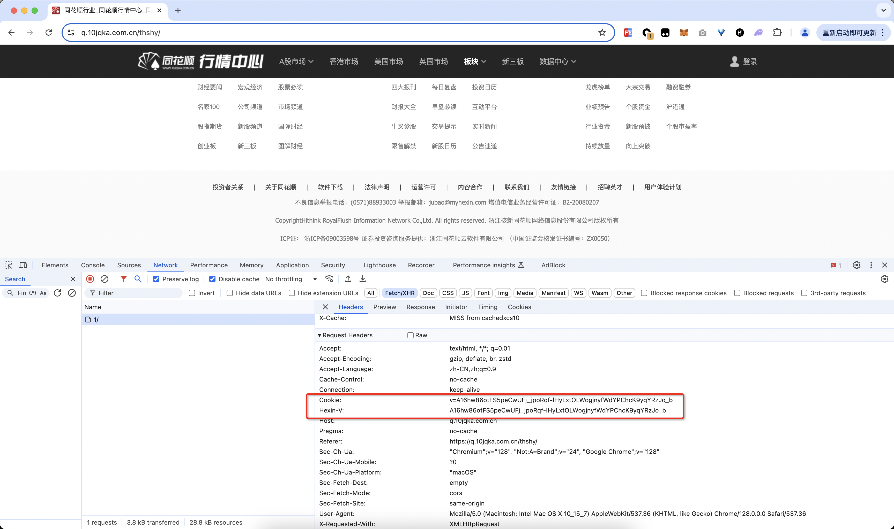
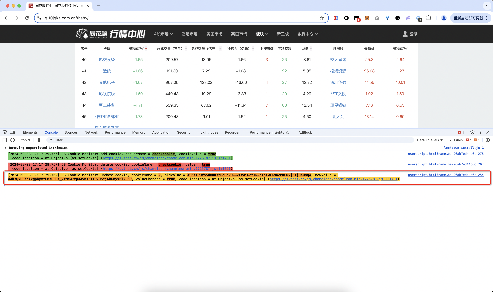
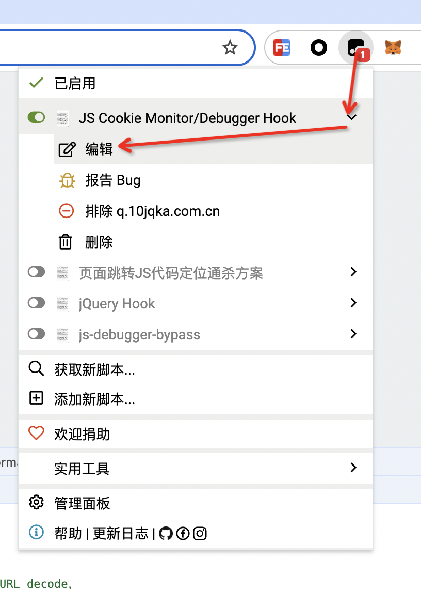
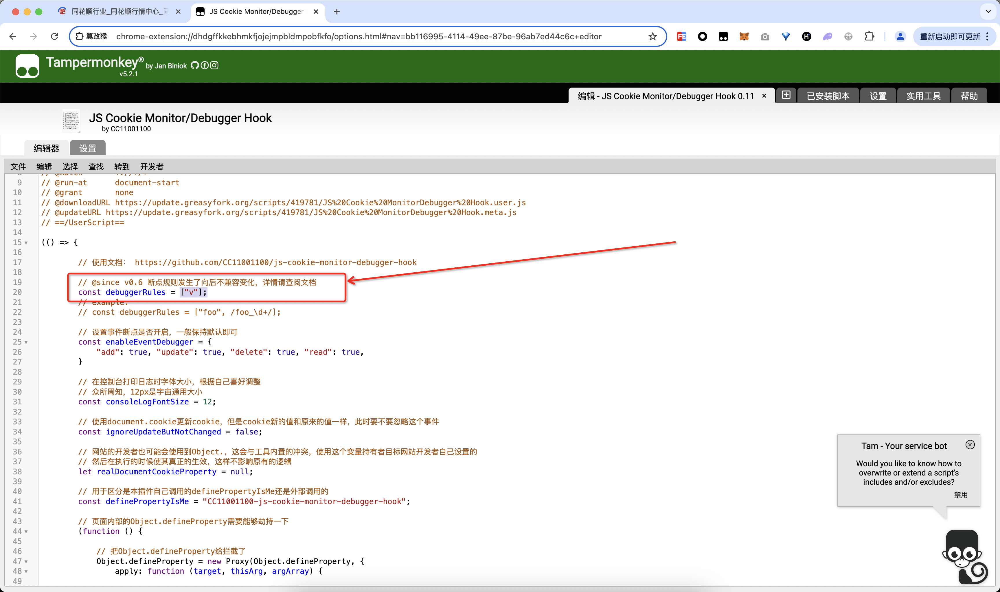
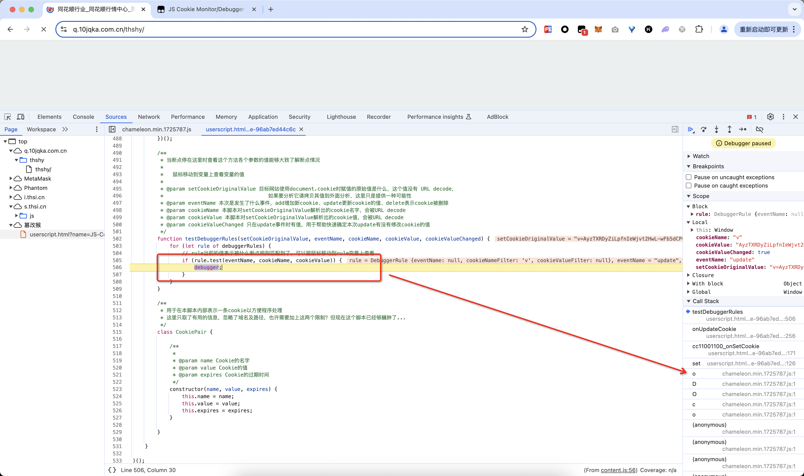
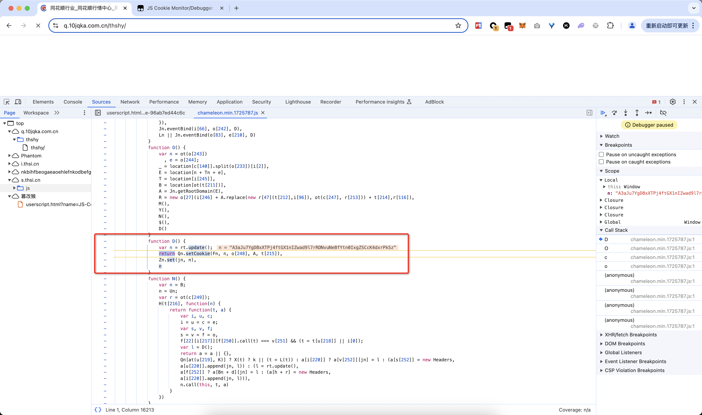
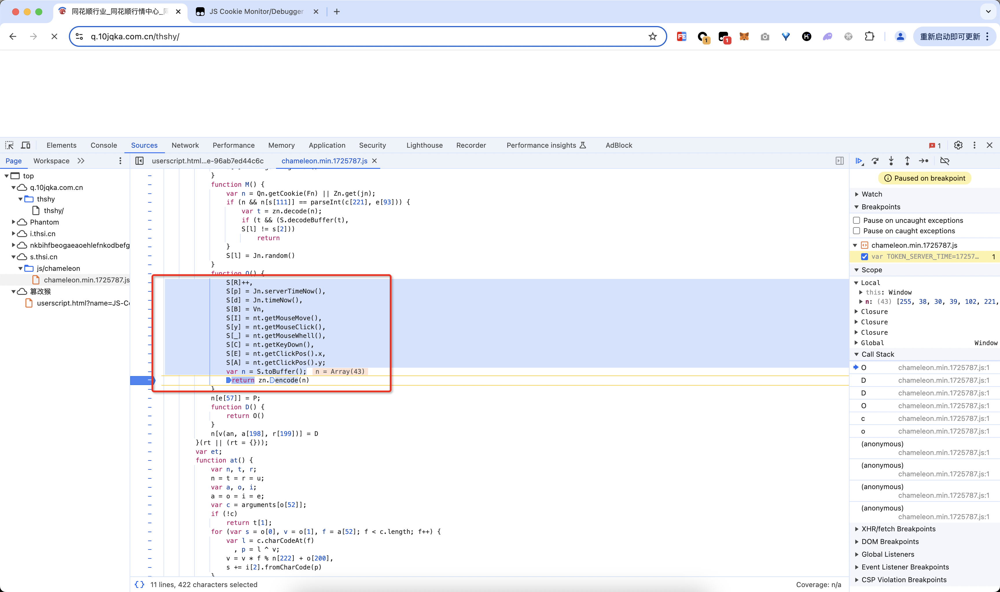

# 同花顺行情中心列表页Cookie加密

# 一、逆向目标

在同花顺行情中心的列表页：

```bash
https://q.10jqka.com.cn/thshy/
```

翻页的时候发送的请求里有一个自定义的请求头`hexin-v`，这个请求头是必须携带的，接下来就是借助`js-cookie-monitor-debugger-hook`来分析这个请求头是如何生成的：



# 二、分析过程

通过上面的请求头可以看到，这个请求头`hexin-v`和名为`v`的cookie的值是一样的，所以接下来就是分析cookie `v`是如何生成的。

安装好``js-cookie-monitor-debugger-hook``插件并开启之后，打开开发者工具刷新页面，可以看到`Console`里打印了一些内容，看起来是插件观察到了`v`的生成过程：



在油猴脚本这里展开脚本选项，选择“编辑”：



然后加上一个断点规则，`["v"]`表示当名为`v`的cookie被操作的时候会进入断点：



然后回到原页面刷新页面，自动命中了断点，这个时候就是向上追踪调用栈：



往后向上追踪调用栈，可以看到Cookie的生成主要是调用了`rt.update()`这个方法生成的：



跟进去发现主要是这个方法生成的，至此逻辑大概明了了，就是采集了一堆信息，然后编码作为`v`的值：



# 三、参考资料

- https://github.com/JSREP/q.10jqka.com.cn-RE